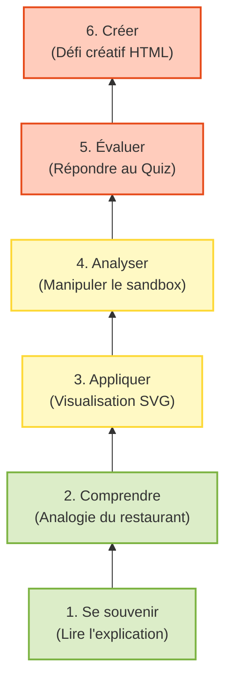
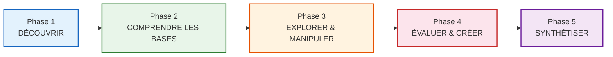
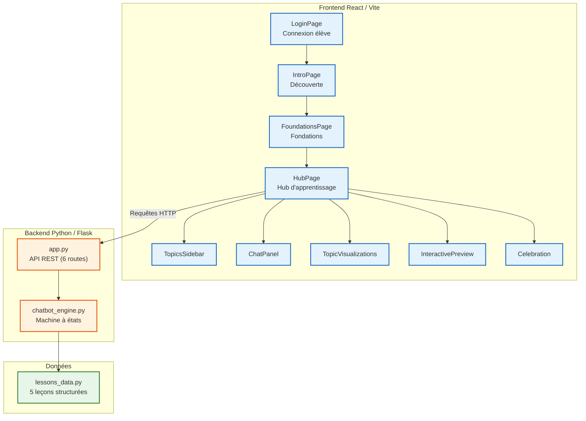
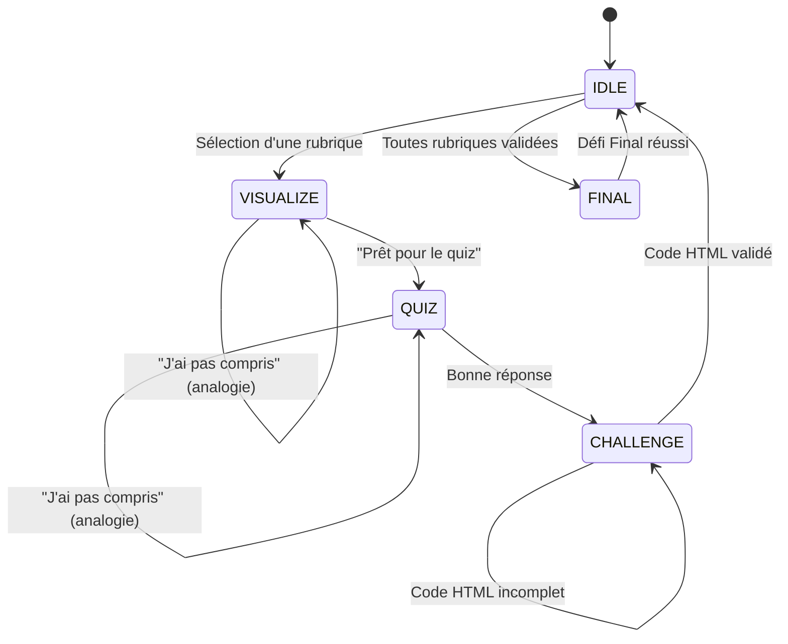
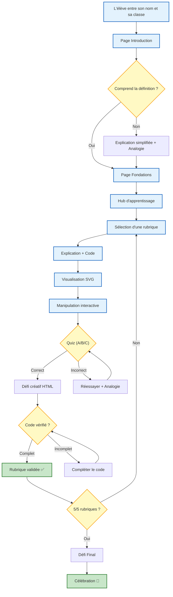

# Design Pédagogique — Chatbot sur la Créativité (Formulaires HTML)

> [!NOTE]
> Ce document présente le design pédagogique complet de mon projet de chatbot éducatif. Il détaille les choix pédagogiques, les théories d'apprentissage mobilisées, le scénario d'apprentissage et l'architecture technique au service de la pédagogie.

---

## 1. Contexte et Problématique

### 1.1. Le constat de départ
L'apprentissage du HTML, en particulier des formulaires web, est souvent enseigné de manière trop théorique dans les classes de lycée. Les élèves lisent du code sur un tableau, recopient des balises sans comprendre leur fonction réelle, et perdent rapidement leur motivation.

### 1.2. La solution proposée
J'ai conçu et développé **CodeBot**, un chatbot éducatif interactif qui enseigne les formulaires HTML à travers une expérience d'apprentissage progressive, visuelle et ludique. L'outil transforme un cours magistral passif en une aventure interactive où l'élève apprend en faisant, pas juste en lisant.

### 1.3. Le public cible
| Caractéristique | Détail |
| :--- | :--- |
| **Âge** | 15-16 ans (classe de Seconde / Première) |
| **Niveau technique** | Débutant complet en HTML |
| **Environnement** | Lycée, salle informatique ou à domicile |
| **Habitudes numériques** | Familiers avec Instagram, TikTok, WhatsApp — habitués aux interfaces dynamiques et colorées |

---

## 2. Théories d'Apprentissage Mobilisées

Mon design pédagogique ne repose pas sur l'improvisation. Il s'appuie sur 3 cadres théoriques reconnus en sciences de l'éducation :

### 2.1. La Taxonomie de Bloom (Hiérarchie Cognitive)
J'ai structuré le parcours pour faire progresser l'élève du niveau cognitif le plus bas (se souvenir) vers le plus élevé (créer).

### 2.2. Le Constructivisme (Piaget / Vygotsky)
L'apprentissage est plus solide quand l'élève **construit** lui-même ses connaissances plutôt que de les recevoir passivement.
*   **Application :** La section Interactive Preview (`InteractivePreview.jsx`) permet à l'élève de manipuler de vrais éléments HTML (cocher des cases, sélectionner des options dans un menu déroulant, remplir des champs) **avant** de passer au quiz. Il découvre par lui-même le comportement des éléments.
*   **Zone Proximale de Développement (ZPD) :** Le chatbot agit comme un tuteur intelligent. Si l'élève dit « j'ai pas compris », le bot ne répète pas la même explication — il bascule vers une **analogie** plus simple (ex : « les boutons radio, c'est comme les boutons d'un ancien poste radio »).

### 2.3. Les 9 Événements de Gagné
Robert Gagné a identifié 9 étapes clés pour un apprentissage efficace. Mon chatbot en implémente la majorité :

| Événement de Gagné | Implémentation dans CodeBot |
| :--- | :--- |
| 1. Capter l'attention | Animation Lottie du robot qui salue l'élève sur la page d'introduction |
| 2. Informer des objectifs | Message de bienvenue personnalisé qui explique le déroulement en 5 étapes |
| 3. Stimuler le rappel | Analogie du menu de restaurant pour raccrocher aux connaissances existantes |
| 4. Présenter le contenu | Explication structurée de chaque rubrique avec exemples de code HTML |
| 5. Guider l'apprentissage | Visualisations SVG interactives et Preview manipulable |
| 6. Susciter la performance | Quiz à choix multiples (A, B, C) |
| 7. Fournir un feedback | Réponse immédiate du bot (« Bravo ! » ou « Oups, réessaie ! ») |
| 8. Évaluer la performance | Défi créatif : l'élève écrit son propre code HTML |
| 9. Favoriser la rétention | Défi Final qui combine toutes les notions apprises |

---

## 3. Scénario Pédagogique Complet

Le parcours d'apprentissage suit un flux précis en **5 phases progressives** :

### Phase 1 — DÉCOUVRIR (IntroPage)
**Objectif :** Contextualiser et motiver.
*   L'élève est accueilli par une animation Lottie (robot qui dit bonjour).
*   La question fondamentale est posée : « Qu'est-ce qu'un formulaire ? »
*   Une définition claire est donnée, accompagnée d'un bouton « Visualiser un exemple ».
*   Si l'élève ne comprend pas, un bouton « J'ai pas compris 🤔 » affiche une explication simplifiée avec des références à Instagram et TikTok.
*   L'analogie du menu de restaurant (SVG) fait le lien entre un concept connu et le concept technique.
*   L'élève peut poser des questions libres au robot (`ThinkingRobot`).

### Phase 2 — COMPRENDRE LES BASES (FoundationsPage)
**Objectif :** Poser les fondations techniques.
*   Explication des éléments structurels d'un formulaire HTML (`<form>`, `<input>`, `<label>`, `<select>`, `<textarea>`).
*   Chaque notion est illustrée par un schéma SVG interactif (composants `FormStructureSVG`, `InputAttributesSVG`, `LabelSVG`, etc.).
*   Un mini-chat intégré permet de poser des questions en direct au bot.
*   Boutons « J'ai pas compris » pour chaque section, déclenchant des explications alternatives.

### Phase 3 — EXPLORER & MANIPULER (HubPage — Visualisation + Sandbox)
**Objectif :** Passer de la théorie à la pratique tactile.
*   L'élève choisit une rubrique dans le menu latéral (`TopicsSidebar`).
*   Le chatbot affiche l'explication de la rubrique.
*   **Étape clé — Visualisation SVG** (`TopicVisualizations.jsx`) : un schéma illustré montre le concept visuellement.
*   **Étape clé — Preview Interactive** (`InteractivePreview.jsx`) : l'élève manipule de vrais éléments HTML fonctionnels (il coche, sélectionne, remplit) sans écrire de code.

### Phase 4 — ÉVALUER & CRÉER (HubPage — Quiz + Défi Créatif)
**Objectif :** Vérifier la compréhension et stimuler la créativité.
*   **Quiz** : 3 choix (A, B, C). Le moteur (`chatbot_engine.py`) détecte la réponse par pattern matching intelligent.
*   **Feedback immédiat** : en cas de bonne réponse → félicitations + passage au défi. En cas d'erreur → encouragement + indice + possibilité de revoir l'analogie.
*   **Défi créatif** : l'élève doit écrire du code HTML réel. Le moteur vérifie la présence des balises attendues (`_check_html_tags`).

### Phase 5 — SYNTHÉTISER (Défi Final)
**Objectif :** Mobiliser toutes les compétences acquises.
*   Débloqué uniquement après validation des 5 rubriques.
*   L'élève doit créer un formulaire d'inscription complet combinant : `text`, `password`, `checkbox`, `radio`, `select`, `textarea`, `submit`, `reset`.
*   Animation de célébration (`Celebration.jsx`) à la réussite.

---

## 4. Architecture Technique au Service de la Pédagogie

### 4.1. Vue d'ensemble du système

### 4.2. La machine à états conversationnelle
Le moteur de conversation (`chatbot_engine.py`) fonctionne comme un **automate fini** qui guide l'élève à travers les étapes :

### 4.3. Contenu pédagogique structuré (lessons_data.py)
Chaque leçon est un objet structuré contenant 5 champs pédagogiques :

| Champ | Rôle pédagogique |
| :--- | :--- |
| `explanation` | Contenu théorique avec exemples de code |
| `analogy` | Explication alternative par analogie (pour les « j'ai pas compris ») |
| `quiz` | Question à choix multiple avec réponse correcte et explication |
| `challenge` | Défi créatif contextuel (scénario réaliste du lycée) |
| `icon` / `title` | Repères visuels pour la navigation |

Les 5 rubriques couvrent :
1. 📝 Zones de saisie (`text`, `password`, `textarea`)
2. ☑️ Cases à cocher (`checkbox`)
3. 🔘 Boutons radio (`radio`)
4. 📋 Listes déroulantes (`select`, `option`)
5. 🔲 Boutons cliquables (`submit`, `reset`)

---

## 5. Stratégies Pédagogiques Clés

### 5.1. L'apprentissage par analogie
Chaque concept technique est d'abord présenté via une analogie tirée de la vie quotidienne de l'adolescent :

| Concept HTML | Analogie utilisée |
| :--- | :--- |
| `<input type="text">` | Une ligne de cahier (on y écrit quelque chose de court) |
| `<textarea>` | Une page entière de cahier (pour un long texte) |
| `<input type="password">` | Écrire avec de l'encre invisible |
| `checkbox` | Une liste de courses (on coche ce qu'on veut) |
| `radio` | Les boutons d'un ancien poste radio (un seul à la fois) |
| `select` | Un menu de restaurant (on ouvre, on choisit, on referme) |
| `submit` / `reset` | Remettre sa copie d'examen / Effacer tout et recommencer |

### 5.2. Le feedback adaptatif
Le chatbot ne se contente pas de dire « Bonne réponse » ou « Mauvaise réponse ». Il adapte sa réponse :
*   **Bonne réponse** → Explication du « pourquoi c'est correct » + transition vers le défi créatif.
*   **Mauvaise réponse** → Encouragement + indice + rappel de la question + suggestion de dire « j'ai pas compris ».
*   **Confusion détectée** → Bascule automatique vers une explication par analogie.
*   **Code HTML incomplet** → Liste visuelle des balises trouvées (✅) et manquantes (❌).

### 5.3. La gamification
Plusieurs mécaniques de jeu sont intégrées pour maintenir la motivation :
*   **Barre de progression** visible en haut de page, qui avance à chaque rubrique validée.
*   **Système de validation par rubrique** : chaque rubrique affiche un check vert une fois complétée.
*   **Défi Final débloquable** : crée un objectif et une récompense à atteindre.
*   **Animation de célébration** (`Celebration.jsx`) avec effets visuels à la fin du parcours.
*   **Avatar animé** (`TeacherAvatar.jsx`) qui réagit en temps réel (idle, thinking, speaking).

### 5.4. L'accessibilité et l'engagement visuel
*   Interface aux couleurs vibrantes, adaptée aux goûts d'un public adolescent (gradients, glassmorphism, animations fluides via Framer Motion).
*   Animations Lottie pour humaniser le robot (hello-robot, coding-animation).
*   Micro-animations sur les boutons (hover, tap) pour renforcer l'interactivité.
*   Particules de fond animées pour dynamiser les pages.

---

## 6. Parcours Utilisateur Complet

---

## 7. Perspectives d'Amélioration

1.  **Tracking de la performance** : Intégrer un système de stockage des résultats (temps passé par rubrique, nombre de tentatives au quiz, erreurs fréquentes) pour identifier les points de blocage pédagogique.
2.  **Adaptation du niveau de difficulté** : Proposer des quiz de difficulté croissante en fonction de la performance (si l'élève réussit du premier coup, proposer une question bonus plus complexe).
3.  **Mode collaboratif** : Permettre à deux élèves de travailler ensemble sur le Défi Final, favorisant l'apprentissage par les pairs (pédagogie de Vygotsky).
4.  **Tableau de bord enseignant** : Créer une interface pour le professeur permettant de suivre la progression de toute la classe en temps réel.
