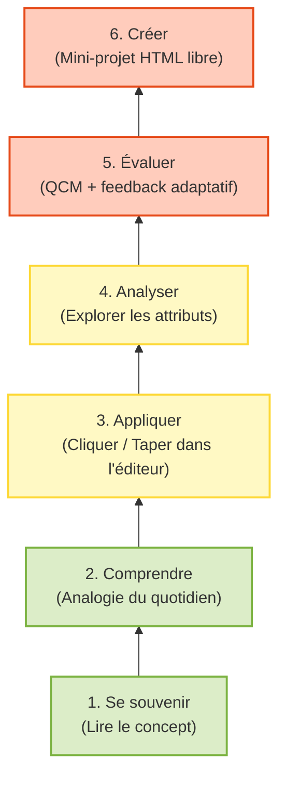
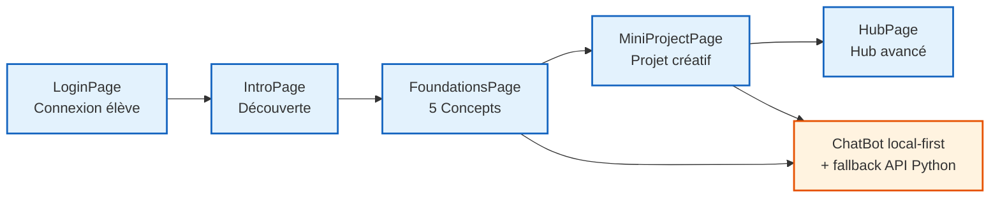
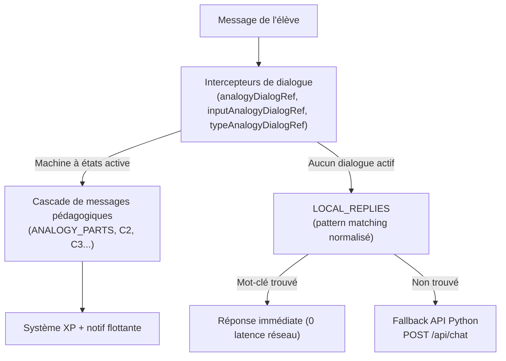
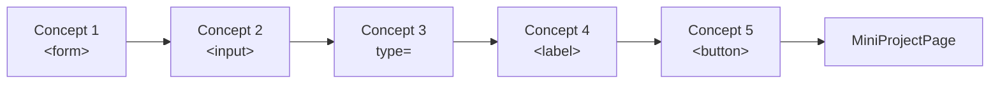
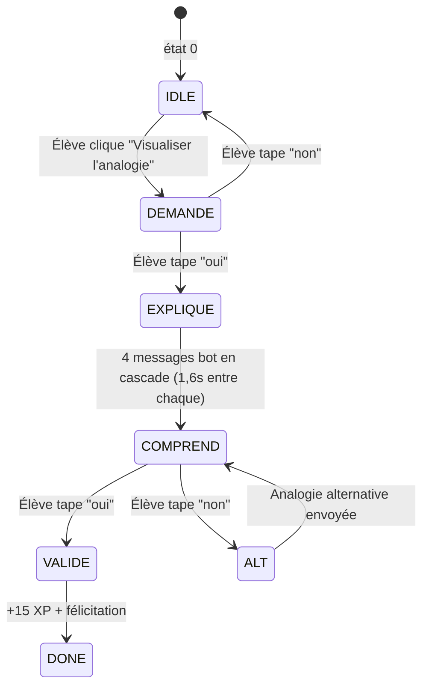
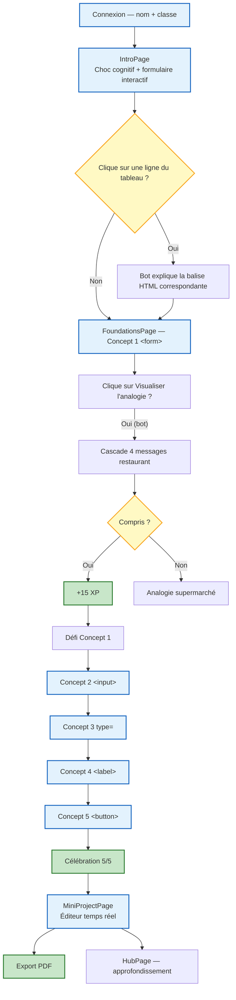

# Design Pédagogique — CodeBot : Apprendre les Formulaires HTML

> **Document de référence** — Ce fichier décrit le design pédagogique réel et actuel de l'application. Il reflète l'état du code en production, les choix d'implémentation effectifs et la logique d'apprentissage telle qu'elle a été construite.

---

## 1. Contexte et Problématique

### 1.1. Le constat de départ
L'apprentissage du HTML, et en particulier des formulaires web, est souvent enseigné de manière trop abstraite dans les lycées. Les élèves lisent du code sur un tableau, recopient des balises sans en comprendre la fonction, et perdent rapidement leur motivation faute de retour immédiat et de sens concret.

### 1.2. La réponse apportée
**CodeBot** est une application web éducative interactive qui enseigne les formulaires HTML à travers un parcours progressif en 4 pages. L'élève ne lit pas — il fait, il clique, il tape, il dialogue avec un chatbot en temps réel. Chaque concept est d'abord vécu (via le formulaire lui-même), puis nommé (explication), puis ancré (analogie + image + dialogue), puis appliqué (pratique + défi).

### 1.3. Le public cible

| Caractéristique | Détail |
| :--- | :--- |
| **Âge** | 15–18 ans (lycée, toutes séries) |
| **Niveau technique** | Débutant absolu en HTML |
| **Environnement** | Salle informatique ou domicile, navigateur moderne |
| **Rapport au numérique** | Utilisateurs quotidiens de formulaires (Instagram, TikTok, Snapchat) sans le savoir |

---

## 2. Théories d'Apprentissage Mobilisées

Le design repose sur trois cadres théoriques articulés ensemble :

### 2.1. La Taxonomie de Bloom — progression cognitive

L'élève est guidé du niveau cognitif le plus bas vers le plus élevé, sans sauter d'étape.

```mermaid
graph BT
    classDef low fill:#dcedc8,stroke:#7cb342,stroke-width:2px;
    classDef mid fill:#fff9c4,stroke:#fdd835,stroke-width:2px;
    classDef high fill:#ffccbc,stroke:#e64a19,stroke-width:2px;

    N1["1. Se souvenir<br/>(Lire le concept)"] --> N2["2. Comprendre<br/>(Analogie du quotidien)"]
    N2 --> N3["3. Appliquer<br/>(Cliquer / Taper dans l'éditeur)"]
    N3 --> N4["4. Analyser<br/>(Explorer les attributs)"]
    N4 --> N5["5. Évaluer<br/>(QCM + feedback adaptatif)"]
    N5 --> N6["6. Créer<br/>(Mini-projet HTML libre)"]

    class N1,N2 low;
    class N3,N4 mid;
    class N5,N6 high;
```

### 2.2. Le Constructivisme (Piaget / Vygotsky)

L'élève construit ses connaissances par l'action et le dialogue, pas par la lecture passive.

- **Action directe :** Sur l'`IntroPage`, l'élève interagit avec un vrai formulaire *avant* de recevoir une explication. Il comprend d'abord *ce que ça fait*, puis *comment ça s'appelle*.
- **Zone Proximale de Développement :** Le chatbot détecte les blocages. Si l'élève tape "non" après une explication, le bot bascule automatiquement vers une analogie alternative plus accessible — jamais la même répétition.
- **Construction par dialogue :** Le dialogue bot/élève est une machine à états réelle. L'élève n'est pas spectateur — ses réponses (oui/non) changent la séquence des messages reçus.

### 2.3. Les 9 Événements de Gagné

| Événement | Implémentation concrète dans CodeBot |
| :--- | :--- |
| 1. Capter l'attention | `IntroPage` : titre "Tu l'utilises déjà. Sans le savoir." — choc cognitif immédiat |
| 2. Informer des objectifs | Message de bienvenue du bot + barre de navigation dots (5 concepts visibles) |
| 3. Stimuler le rappel | Analogies tirées du quotidien (restaurant, enveloppe, cuisine) avant tout code |
| 4. Présenter le contenu | Blocs de code interactifs avec syntaxe colorée par rôle sémantique |
| 5. Guider l'apprentissage | Dialogue bot en cascade (4 messages progressifs) + image révélable à la demande |
| 6. Susciter la performance | Éditeur temps réel (`MiniProjectPage`) + défi verrouillé par concept |
| 7. Fournir un feedback | Réponse immédiate du bot selon la réponse (oui/non) + +XP animé |
| 8. Évaluer la performance | QCM avec feedback adaptatif + vérification de code dans le mini-projet |
| 9. Favoriser la rétention | `MiniProjectPage` : créer un formulaire complet + export PDF à conserver |

---

## 3. Architecture de l'Application

### 3.1. Vue d'ensemble des pages

```mermaid
graph LR
    classDef page fill:#e3f2fd,stroke:#1565c0,stroke-width:2px;
    classDef comp fill:#f3e5f5,stroke:#6a1b9a,stroke-width:1px;
    classDef back fill:#fff3e0,stroke:#e65100,stroke-width:2px;

    Login["LoginPage<br/>Connexion élève"] --> Intro["IntroPage<br/>Découverte"]
    Intro --> Found["FoundationsPage<br/>5 Concepts"]
    Found --> Mini["MiniProjectPage<br/>Projet créatif"]
    Mini --> Hub["HubPage<br/>Hub avancé"]

    Found --> ChatBot["ChatBot local-first<br/>+ fallback API Python"]
    Mini --> ChatBot

    class Login,Intro,Found,Mini,Hub page;
    class ChatBot back;
```

### 3.2. Stack technique

| Couche | Technologies |
| :--- | :--- |
| **Frontend** | React 18 + Vite, Framer Motion, react-icons |
| **Routage** | React Router v6, lazy loading des pages |
| **Chat** | Local-first (réponses JSX pré-écrites) + fallback HTTP vers Flask |
| **Voix** | Web Speech Synthesis API (browser natif) |
| **Export** | html2pdf.js (PDF côté client, zéro serveur) |
| **Persistance** | `sessionStorage` (session utilisateur sans base de données) |
| **Backend** | Python / Flask (API REST, utilisé en fallback uniquement) |

### 3.3. Architecture du chatbot — Local-first

Le chatbot fonctionne en deux niveaux :

```mermaid
graph TD
    MSG["Message de l'élève"] --> INT["Intercepteurs de dialogue<br/>(analogyDialogRef, inputAnalogyDialogRef, typeAnalogyDialogRef)"]
    INT -->|"Machine à états active"| CASCADE["Cascade de messages pédagogiques<br/>(ANALOGY_PARTS, C2, C3...)"]
    INT -->|"Aucun dialogue actif"| LOCAL["LOCAL_REPLIES<br/>(pattern matching normalisé)"]
    LOCAL -->|"Mot-clé trouvé"| REPLY["Réponse immédiate (0 latence réseau)"]
    LOCAL -->|"Non trouvé"| API["Fallback API Python<br/>POST /api/chat"]
    CASCADE --> XP["Système XP + notif flottante"]
```

---

## 4. Scénario Pédagogique Page par Page

### Phase 1 — DÉCOUVRIR (`IntroPage`)

**Objectif pédagogique :** Créer un conflit cognitif — l'élève réalise qu'il *utilise* déjà des formulaires sans le savoir.

**Séquence :**
1. **Accroche** — Titre "Tu l'utilises déjà. Sans le savoir." → déstabilisation volontaire
2. **Révélation progressive** — Le bot envoie 2 messages avant d'afficher le formulaire (`formReady`). L'élève ne voit pas d'emblée du code — il vit d'abord l'expérience
3. **Formulaire interactif** — Chaque ligne du tableau de données est cliquable : cliquer sur "Prénom" déclenche une explication bot du tag HTML correspondant (`handleFieldClick`)
4. **Banner de découverte** — 2 états : découverte partielle → découverte complète, avec animation de révélation
5. **Mode voix** — Toggle pour que le bot lise ses réponses à voix haute (`Web Speech Synthesis`). Bouton de stop et de toggle avec icônes react-icons

**Valeur pédagogique :** L'élève part de son vécu (il a déjà rempli un formulaire Instagram) et remonte vers le concept HTML. Le sens précède la syntaxe.

---

### Phase 2 — COMPRENDRE LES BASES (`FoundationsPage`)

**Objectif pédagogique :** Construire une représentation mentale solide des 5 balises fondamentales des formulaires, concept par concept, en allant du connu vers l'inconnu.

Le parcours est structuré en **5 concepts progressifs et verrouillés**. Chaque concept doit être exploré avant de pouvoir accéder au défi. La progression est visible via des **navigation dots** en haut de page.

```mermaid
graph LR
    C1["Concept 1<br/>&lt;form&gt;"] --> C2["Concept 2<br/>&lt;input&gt;"]
    C2 --> C3["Concept 3<br/>type="]
    C3 --> C4["Concept 4<br/>&lt;label&gt;"]
    C4 --> C5["Concept 5<br/>&lt;button&gt;"]
    C5 --> MP["MiniProjectPage"]
```

#### Concept 1 — `<form>` : Le conteneur

**Analogie :** Le plateau de restaurant
- Le plateau = `<form>` (regroupe tout d'un coup)
- Les plats = les `<input>` (chaque info)
- "C'est bon !" = le bouton submit
- La cuisine = le serveur informatique

**Mécanique pédagogique :**
- Lignes de code cliquables avec annotations apparaissant au survol (`action=`, `method=`)
- Bouton "Visualiser l'analogie en image" → image `/images/image analogie form .jpeg`
- Au clic : le bot déclenche un **dialogue en cascade** (machine à états, `analogyDialogRef`)
- L'élève répond "oui" → 4 messages progressifs espacés (1,6 s entre chaque)
- L'élève répond "non" après la cascade → analogie alternative (panier de supermarché)
- Validation : "oui" → **+15 XP** + notification flottante + message de félicitation
- Défi verrouillé jusqu'à exploration du code → débloqué → QCM → validation → Concept 2

#### Concept 2 — `<input>` : Le champ de saisie

**Analogie :** Les lignes pointillées d'une enveloppe postale
- L'enveloppe = `<form>` (toujours autour)
- Les lignes pointillées = les `<input>` (on y écrit une info précise)
- Chaque ligne a un rôle : `type="email"` vérifie le @, `type="password"` cache les caractères
- Règle d'or : on écrit *sur* l'enveloppe → `<input>` *dans* `<form>`, toujours

**Mécanique pédagogique :**
- **Éditeur temps réel** : l'élève tape `<input>` dans la zone de code → le champ apparaît dans le rendu en direct
- 3 étapes guidées par le bot : apparition → disparition → réapparition (effet "wow / pouf")
- Bouton "Visualiser l'analogie en image" → image `/images/image analogie 2.jpeg`
- Dialogue bot en machine à états (`inputAnalogyDialogRef`) identique au Concept 1
- Analogie alternative (non) : feuille d'examen à rendre au prof
- Attributs cliquables après exploration : `type`, `name`, `placeholder`, `required` → mode pratique par attribut

#### Concept 3 — `type=` : Chaque champ a son rôle

**Analogie :** Les ustensiles de cuisine
- Une fourchette pour les pâtes, une louche pour la soupe — jamais l'inverse
- `type="text"` → cuillère polyvalente
- `type="email"` → tamis (filtre et vérifie le @)
- `type="password"` → boîte hermétique (cache le contenu)
- `type="number"` → balance de cuisine (chiffres uniquement)

**Mécanique pédagogique :**
- Onglets de type (`text`, `password`, `email`, `number`) avec prévisualisation live
- Bouton "Pratiquer" apparaît après exploration de chaque type
- Bouton "Visualiser l'analogie en image" → image `/images/image analogie 3.jpeg`
- Dialogue bot (`typeAnalogyDialogRef`) avec cascade de 4 messages + analogie transports en fallback
- **+15 XP** à la compréhension validée

#### Concept 4 — `<label>` : L'étiquette du champ

**Mécanique :** Clic sur le label dans le rendu → le curseur saute dans le champ lié (comportement natif du navigateur révélé comme magie). QCM + défi pratique.

#### Concept 5 — `<button>` : Le déclencheur

**Mécanique :** Choix du `type` (`submit`, `button`, `reset`) avec explication des conséquences. QCM final → déverrouille l'accès à `MiniProjectPage`.

**Système transversal — Chatbot `FoundationsPage` :**

| Fonctionnalité | Détail |
| :--- | :--- |
| **Local-first** | `LOCAL_REPLIES` : 12+ réponses pré-écrites (GET vs POST, action=, required…) |
| **Chips de question** | Boutons de question rapide contextuels par concept (ex: "GET vs POST ?") |
| **Questions folles** | 5 questions ouvertes aléatoires pour stimuler la réflexion critique |
| **Deep Thinking** | Mode activable pour signaler une question complexe (simulé, prêt pour connexion LLM) |
| **Fallback API** | Si aucune réponse locale → `POST /api/chat` vers le backend Python |
| **XP système** | +15 XP par analogie validée, notification flottante animée |
| **Célébration** | Animation de célébration à la fin des 5 concepts |

---

### Phase 3 — CRÉER (`MiniProjectPage`)

**Objectif pédagogique :** Mobiliser toutes les connaissances acquises dans une production personnelle concrète et exportable.

**Fonctionnalités :**
- **Éditeur de code HTML** en temps réel avec rendu dans un iframe
- **Chatbot d'analyse** : après chaque balise ajoutée, le bot interpelle l'élève pour analyser son code ("tu veux qu'on analyse ce que tu viens d'écrire ?")
- **Mode jour/nuit** : toggle avec `FiSun` / `FiMoon` — couleurs de l'interface adaptées conditionnellement (inline styles pour surclasser les classes CSS)
- **Export PDF** : `html2pdf.js` — génère un PDF du rendu directement côté client, sans serveur
- **Bouton "Approfondir mes connaissances"** avec icône `FiArrowRight` → redirection vers `HubPage`

**Valeur pédagogique :** L'élève repart avec une production tangible (le PDF) — preuve de ce qu'il a construit. Cela ancre l'apprentissage et crée de la fierté.

---

### Phase 4 — EXPLORER EN PROFONDEUR (`HubPage`)

**Objectif pédagogique :** Offrir un espace de pratique libre et approfondie pour les élèves qui veulent aller plus loin.

**Fonctionnalités :**
- Menu rubriques latéral (`TopicsSidebar`) : 5 rubriques thématiques
- Panel de chat connecté au backend Python (`ChatPanel`)
- Visualisations SVG par rubrique (`TopicVisualizations`)
- Preview interactive (`InteractivePreview`) : manipulation de vrais éléments HTML sans écrire de code
- Animation de célébration finale (`Celebration`) quand toutes les rubriques sont complétées

---

## 5. Mécaniques Pédagogiques Transversales

### 5.1. Le dialogue par analogie en cascade — pattern central

C'est la mécanique la plus importante de `FoundationsPage`. Elle transforme une image statique en dialogue pédagogique actif.

```mermaid
stateDiagram-v2
    [*] --> IDLE : état 0
    IDLE --> DEMANDE : Élève clique "Visualiser l'analogie"
    DEMANDE --> EXPLIQUE : Élève tape "oui"
    DEMANDE --> IDLE : Élève tape "non"
    EXPLIQUE --> COMPREND : 4 messages bot en cascade (1,6s entre chaque)
    COMPREND --> VALIDE : Élève tape "oui"
    COMPREND --> ALT : Élève tape "non"
    ALT --> COMPREND : Analogie alternative envoyée
    VALIDE --> DONE : +15 XP + félicitation
```

**Implémentation :** `useRef` (pas `useState`) pour stocker l'état du dialogue — évite les re-renders inutiles et les stale closures dans `useCallback`.

### 5.2. Catalogue des analogies utilisées

| Concept HTML | Analogie principale | Analogie de secours |
| :--- | :--- | :--- |
| `<form>` | Plateau de restaurant | Panier de supermarché |
| `<input>` | Lignes pointillées d'une enveloppe | Feuille d'examen à rendre au prof |
| `type=` | Ustensiles de cuisine (fourchette, louche…) | Transports en ville (vélo, GPS, coffre blindé) |
| `<label>` | Étiquette d'un casier scolaire | — |
| `<button>` | Bouton "Remettre sa copie" | — |

### 5.3. Système de gamification

| Mécanique | Implémentation |
| :--- | :--- |
| **XP flottant** | `+15 XP` animé avec `setXpNotif`, disparaît après 1,8 s |
| **Navigation dots** | 5 pastilles de progression cliquables (locked / active / done) |
| **Défi verrouillé** | Le défi n'est visible qu'après exploration du code (composant `ChallengeSection`) |
| **Concepts séquentiels** | Chaque concept doit être validé pour débloquer le suivant |
| **Célébration finale** | Animation de confettis après le 5e concept validé |
| **Export PDF** | Production tangible exportable depuis `MiniProjectPage` |

### 5.4. Le mode voix

L'élève peut activer un mode voix sur `IntroPage` : toutes les réponses du bot sont lues par le navigateur via `window.speechSynthesis`. Un bouton stop permet d'interrompre à tout moment. Implémenté avec `useRef` (`voiceModeRef`) pour éviter les stale closures dans les callbacks asynchrones.

### 5.5. Feedback adaptatif

Le chatbot ne répond jamais de manière identique à deux situations différentes :

| Situation | Réponse du bot |
| :--- | :--- |
| Élève dit "oui" après l'explication | Félicitations + XP + suite du parcours |
| Élève dit "non" après l'explication | Analogie alternative (jamais la même) |
| Élève dit "j'ai pas compris" | Demande de précision ("sur quel point tu bloques ?") |
| Élève pose une question connue | Réponse locale immédiate depuis `LOCAL_REPLIES` |
| Question inconnue | Fallback API Python |
| Deep Thinking activé | Message spécifique + simulation de réflexion profonde |

---

## 6. Parcours Utilisateur Complet

```mermaid
graph TD
    classDef action fill:#e3f2fd,stroke:#1565c0,stroke-width:2px;
    classDef decision fill:#fff9c4,stroke:#f9a825,stroke-width:2px;
    classDef success fill:#c8e6c9,stroke:#2e7d32,stroke-width:2px;
    classDef xp fill:#fce4ec,stroke:#c62828,stroke-width:2px;

    Start["Connexion — nom + classe"] --> Intro["IntroPage<br/>Choc cognitif + formulaire interactif"]
    Intro --> Q1{"Clique sur une ligne du tableau ?"}
    Q1 -->|"Oui"| Explain1["Bot explique la balise HTML correspondante"]
    Q1 -->|"Non"| Found
    Explain1 --> Found["FoundationsPage — Concept 1 &lt;form&gt;"]
    Found --> Analogy1["Clique sur Visualiser l'analogie ?"]
    Analogy1 -->|"Oui (bot)"| Cascade1["Cascade 4 messages restaurant"]
    Cascade1 --> Q2{"Compris ?"}
    Q2 -->|"Oui"| XP1["+15 XP"]
    Q2 -->|"Non"| Alt1["Analogie supermarché"]
    XP1 --> Challenge1["Défi Concept 1"]
    Challenge1 --> C2["Concept 2 &lt;input&gt;"]
    C2 --> C3["Concept 3 type="]
    C3 --> C4["Concept 4 &lt;label&gt;"]
    C4 --> C5["Concept 5 &lt;button&gt;"]
    C5 --> Celeb["Célébration 5/5"]
    Celeb --> Mini["MiniProjectPage<br/>Éditeur temps réel"]
    Mini --> PDF["Export PDF"]
    Mini --> Hub["HubPage — approfondissement"]

    class Start,Intro,Found,C2,C3,C4,C5,Mini action;
    class Q1,Q2 decision;
    class XP1,Celeb,PDF success;
```

---

## 7. Ce qui Reste à Construire

| Fonctionnalité | Statut | Note |
| :--- | :--- | :--- |
| Dialogue analogie Concept 4 (`<label>`) | À faire | Même pattern que C1/C2/C3 |
| Dialogue analogie Concept 5 (`<button>`) | À faire | Même pattern |
| Connexion LLM réelle (Deep Thinking) | À faire | Infrastructure prête côté Flask |
| Tracking de performance par élève | À faire | Identifier les points de blocage récurrents |
| Tableau de bord enseignant | À faire | Suivi de progression de la classe |
| Mode collaboratif | À faire | Pédagogie par les pairs (Vygotsky) |
| Accessibilité (WCAG AA) | À faire | Contraste, navigation clavier, aria-labels |
