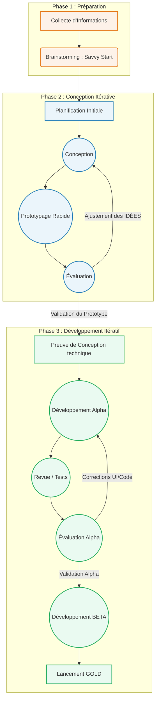

# Analyse Structurée : Le Chatbot de Créativité via la Méthode SAM

> [!NOTE]
> Ce document fournit une compréhension approfondie de la méthode SAM (Successive Approximation Model) et de son application concrète au développement de votre Chatbot sur la créativité. Il est conçu pour être utilisé comme base solide pour une présentation professionnelle ou académique.

## 1. Compréhension Fondamentale : Qu'est-ce que la Méthode SAM ?

La méthode **SAM (Successive Approximation Model)**, créée par Michael Allen, est une approche agile de conception pédagogique et de développement logiciel éducatif. Contrairement aux méthodes traditionnelles linéaires (comme le modèle en cascade ou ADDIE), SAM repose sur l'**itération rapide**, le **prototypage continu** et la **collaboration étroite** avec les parties prenantes.

L'objectif principal n'est pas d'atteindre la perfection du premier coup par d'épaisses documentations, mais d'obtenir un produit fonctionnel rapidement (une "approximation"), de l'évaluer, et de l'améliorer ("successivement") en fonction des retours concrets et visuels.

---

## 2. Décomposition Hiérarchique du Cycle SAM

La méthode SAM se divise en trois grandes phases, que nous pouvons transposer directement à l'évolution de votre Chatbot.

### Phase 1 : Phase de Préparation (Preparation Phase)
L'objectif est d'aligner les attentes et de définir le cadre général. On ne cherche pas la perfection, mais une direction claire.
*   **Collecte d'informations :** Identification du public cible (jeunes de 15-16 ans), du but pédagogique (enseigner les bases de la créativité numérique), et du socle technique (React, Vite, Python).
*   **Le "Savvy Start" (Lancement Intelligent) :** Un brainstorming dynamique. C'est le moment où les idées émergent, comme l'envie d'une interface non pas austère, mais dotée d'animations dynamiques et de gradients colorés adaptés à un public jeune.

### Phase 2 : Phase de Conception Itérative (Iterative Design Phase)
Cette phase consiste à prototyper rapidement les idées issues de la phase de préparation dans une boucle courte.
*   **Planification de projet :** Définition des sprints et des tâches prioritaires.
*   **Conception additionnelle & Prototypage :** C'est ici que sont nés les premiers composants de la landing page ou du composant `App.jsx`. L'idée est de modéliser le flux : comment l'étudiant navigue-t-il ? 
*   *Le cycle "Conception -> Prototype -> Évaluation" est répété en petite boucle jusqu'à ce que la direction globale de l'User Experience (UX) soit validée.*

### Phase 3 : Phase de Développement Itératif (Iterative Development Phase)
C'est ici que l'application est réellement codée, robuste, raffinée et finalisée, en passant par plusieurs états qualitatifs.
*   **Preuve de conception (Design Proof) :** Validation d'une fonctionnalité complexe de bout en bout (ex: le bac à sable interactif HTML ou l'interaction avec l'avatar de l'enseignant).
*   **Version Alpha :** Le Chatbot fonctionne avec toutes ses étapes d'apprentissage (Introduction, Visualisation, Sandbox, Quiz) assemblées, mais il est encore brut.
*   **Version Beta :** Affinage qualitatif. On corrige l'Alpha, on lisse l'UI/UX (les refontes de votre thème pour le rendre plus "vibrant"), on améliore le contenu des `lessons_data.py`.
*   **Version Gold (Or) :** La version finale ("Release Canditate") prête à être déployée aux utilisateurs réels.

---

## 3. Schéma Explicatif : Modélisation du Cycle SAM

---

## 4. Tableau Synthétique : Argumenter l'usage de SAM

Ce tableau vous servira si l'on vous demande *pourquoi* vous avez développé ce chatbot avec SAM plutôt qu'avec une méthode traditionnelle.

| Principe SAM | Application au projet `chatbot_creativite` | Bénéfice direct obtenu |
| :--- | :--- | :--- |
| **Itération Rapide** | Au lieu de coder théoriquement toute la `HubPage` d'un coup, on crée l'arborescence, on teste avec React, puis on injecte l'interactivité (module HTML). | Permet de s'assurer que le "flow" pédagogique est pertinent avant de verrouiller la logique de code backend. |
| **La puissance du Prototypage** | L'utilisation de **React + Vite** permet une recompilation instantanée (HMR) à chaque changement CSS/JSX. | Rendu immédiat des itérations de design. Idéal pour valider rapidement les thèmes sombres/colorés demandés par les jeunes. |
| **Évaluation Continue**| Le projet a évolué d'une simple structure vers un flux divisé : Leçon -> Visualisation -> Manipulation -> Quiz. | Évite le risque "Tunnel" : on ne découvre pas à la fin du projet que l'expérience est trop théorique, on corrige le tir en cours de route. |

---

## 5. Perspectives Critiques et Recommandations (Avis d'Expert)

> [!TIP]
> **Diagnostic de l'état actuel :**
> À travers l'historique de votre projet, vous avez très bien navigué entre la "Conception" et le "Développement Alpha/Beta". Vous êtes actuellement dans le perfectionnement de la phase de **Développement Itératif**.

**En tant qu'analyste, voici 3 recommandations stratégiques pour maîtriser cette méthode jusqu'au bout :**

1.  **Surveillez le risque de "Scope Creep" (Dérapage du périmètre) :**
    La force de SAM (les retours continus) est aussi son plus grand piège. En permettant l'ajout constant de nouvelles idées à chaque itération, vous risquez de ne jamais atteindre la version "Gold".
    *Recommandation :* Figez dès maintenant une *Définition du Terminé (Definition of Done)* pour la version 1.0 (ex: 1 module de leçon complet + les composants 100% fonctionnels). Les idées géniales qui suivent iront dans la version 2.0.
2.  **Mesurez l'efficacité pédagogique (La finalité de SAM) :**
    SAM est une méthode de conception *d'apprentissage*. Avoir une belle UI dynamique est une chose, s'assurer que l'utilisateur de 15 ans retient le concept en est une autre.
    *Recommandation :* Intégrez lors de vos prochaines itérations simples, un moyen de "tracker" les résultats des quiz et où les utilisateurs rencontrent un blocage mental dans la manipulation.
3.  **Impliquez les End-Users (Utilisateurs Finaux) :**
    Dans l'approche SAM, l'évaluation de la phase Beta ne doit pas être faite uniquement par le développeur.
    *Recommandation :* Avant l'étape finale "Gold", mettez la version actuelle dans les mains d'un réel jeune de 15-16 ans pendant 10 minutes. C'est l'essence même de SAM : laisser l'utilisateur final confirmer si l'approximation actuelle est la bonne.
