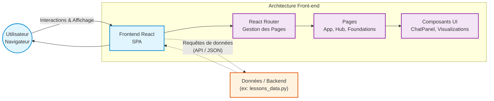
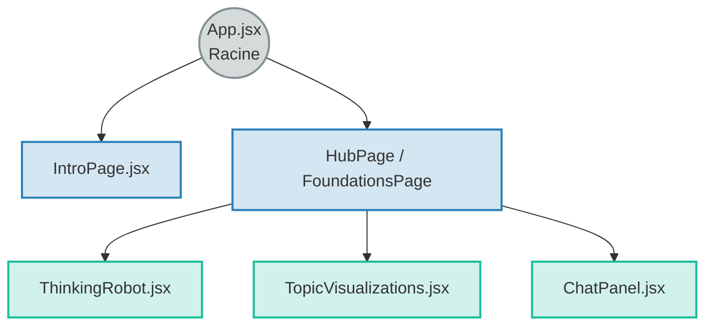

# Analyse Structurée : L'Ingénierie Logicielle du Chatbot de Créativité

> [!NOTE]
> Ce document met en lumière les principes fondamentaux d'ingénierie logicielle appliqués à votre projet. Il analyse comment votre code est structuré, pensé et outillé pour être maintenable, évolutif et performant.

## 1. Compréhension Fondamentale : L'Architecture du Système

L'ingénierie logicielle commence par définir la façon dont les différentes parties de l'application communiquent entre elles. Votre projet s'oriente vers une architecture découplée, séparant clairement l'interface utilisateur de la logique de données.

### Le Modèle "Client-Côté" (Front-end SPA)
Votre application est une **SPA (Single Page Application)**.
*   **Le principe :** Le navigateur télécharge la coquille de l'application (HTML/JS/CSS) une seule fois au chargement initial. Ensuite, c'est le JavaScript (React) qui réécrit dynamiquement le contenu de la page en fonction des actions de l'utilisateur, sans jamais recharger la page entière.
*   **L'avantage d'ingénierie :** Une fluidité extrême (UX similaire à une application native) et une réduction drastique de la charge sur le serveur, puisque seule la donnée (le contenu des leçons, les scores) transite, et non des pages HTML complètes.

### Schéma Architectural Haut Niveau

---

## 2. Conception Orientée Composants (Component-Based Design)

Le choix de **React** dicte votre style d'ingénierie : le développement par composants. C'repose sur le principe de **Haute Cohésion** et de **Faible Couplage**.

*   **Modularité et Réutilisabilité :** Au lieu de créer des pages monolithiques gigantesques (des milliers de lignes de code), vous décomposez l'interface en briques indépendantes (`ChatPanel`, `ThinkingRobot`, `TopicVisualizations`).
*   **Isolation des responsabilités (Separation of Concerns) :** Le composant `ThinkingRobot` ne gère que son animation et sa propre logique. Il se moque de savoir comment fonctionne le composant `FoundationsPage`. Si l'animation plante, le reste de la page continue de fonctionner.

### Schéma de Hiérarchie des Composants (Arbre Structuré)

---

## 3. Gestion d'État et Flux de Données (State Management)

L'un des défis majeurs de l'ingénierie front-end est la synchronisation de l'affichage avec la "vérité" de l'application (l'état).

*   **Flux Unidirectionnel (One-Way Data Binding) :** Dans React, les données cascadent de haut en bas (du composant parent vers les enfants via les *props*). Un composant enfant (`ChatPanel`) ne peut pas modifier directement les données de son parent (`HubPage`) ; il doit utiliser une fonction passée par le parent (un callback) pour demander un changement d'état.
*   **Prédictibilité du système :** Cette contrainte architecturale rend le code extrêmement prévisible. Il est facile de pister la source d'un bug puisqu'on sait exactement dans quelle direction les données circulent.

---

## 4. Outils de Construction et Performance (Build Tooling : Vite)

Le choix de **Vite** dans votre projet n'est pas qu'une question de confort ; c'est une décision d'ingénierie liée à l'expérience développeur (DX) et à l'optimisation.

| Outil / Technologie | Rôle en Ingénierie Pédagogique | Impact Technique |
| :--- | :--- | :--- |
| **Vite** | Moteur de construction (Build tool) & Serveur de développement. | Remplacement de Webpack. Utilise les modules ES natifs du navigateur pour un démarrage serveur < 500ms et un Hot Module Replacement (HMR) instantané. Idéal pour pivoter rapidement (Méthode SAM). |
| **React (Virtual DOM)**| Moteur de rendu UI. | Au lieu de modifier la page vue par l'utilisateur à chaque lettre tapée, React calcule les changements en mémoire (Virtual DOM) et n'applique que le minimum absolu à l'écran. |
| **CSS Modules / Vanilla CSS**| Encapsulation stylistique. | Évite le "CSS Global Leak". Les styles de `.chat-box` dans `ChatPanel.css` n'affecteront jamais une div `.chat-box` située ailleurs par accident. |

---

## 5. Perspectives Critiques et Recommandations (Avis d'Expert)

> [!CAUTION]
> **Alerte Architecture :**
> Plus votre outil d'apprentissage va s'enrichir (plus de leçons, de flux, de quiz), plus le "Prop Drilling" (passer les données de parent en enfant sur 5 niveaux de profondeur) va devenir un cauchemar de maintenance.

**Règles de bonne pratique pour la phase de scalabilité (mise à l'échelle) :**

1.  **Anticipez la gestion d'état globale :**
    Si l'avatar du professeur, les points du quiz, et la barre de progression doivent communiquer entre eux depuis des pages différentes, l'état local (`useState`) ne suffira plus.
    *Recommandation :* Commencez à envisager l'intégration de la `Context API` de React ou d'outils légers comme `Zustand` pour centraliser le "cerveau" de l'application (le score général, la leçon courante).
2.  **Mettez en place du "Type Safety" progressif :**
    Le JavaScript pur est permissif. Si `lessons_data.py` (votre source de vérité probable) change sa structure de donnée sans prévenir le front-end, l'application crashera en silence.
    *Recommandation :* Intégrez des PropTypes dans vos composants React, ou documentez très rigoureusement les objets de données attendus via JSDoc pour garantir la robustesse de l'API front-end.
3.  **Surveillez le "Bundle Size" :**
    Un bot pour des adolescents doit s'ouvrir instantanément sur mobile. L'accumulation de dépendances (librairies d'animations lourdes, polices extravagantes) ralentira le chargement initial.
    *Recommandation :* Utilisez le "Lazy Loading" (chargement asynchrone) pour les routes complexes (`FoundationsPage`) afin que le navigateur ne télécharge le code lié à cette page que lorsque l'utilisateur clique sur le bouton pour y aller.
